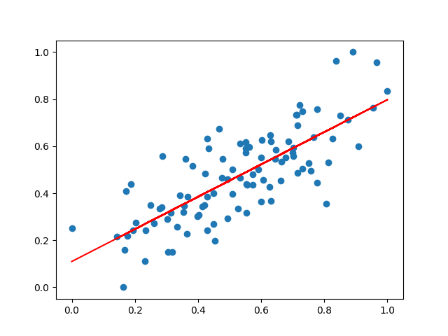

# Lin_Reg_From_Scratch

## Purpose

The goal of this project is to learn to implement a basic linear regression without the
usage of libraries.

## Approach

First, I imported a data set of students in which x is the hours studied and y is the
grade obtained on a test. I initialized the hyperparameters needed: learning rate,
epochs and implemented the loss function as mean squared error. I also initialized
m and b which are the parameters that are to be learnt through this model. During each epoch,
the loss function is calculated. Then, the gradient with respect to m and b are calculated
and m and b are updated by the gradient multiplied by the learning rate. In the end, after
all the epochs are finished, the ending m, b and loss are printed. Initially, my loss
at the end was very high, but I was able to solve this problem by normalizing the data.

## Language + Libraries Used

Python | Libaries: Numpy and Matplotlib

## Credit

Dataset from [Siraj Raval](https://github.com/llSourcell/linear_regression_live)

## End Result

learned_b: 0.110
learned_m: 0.689
Loss: 0.015

